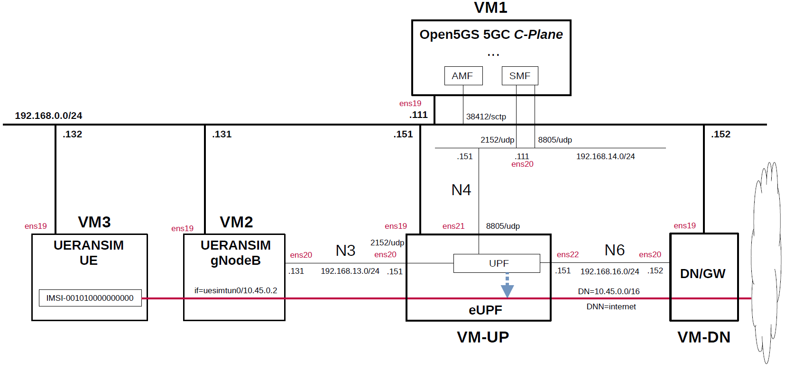

# Open5GS 5GC & UERANSIM UE / RAN Sample Configuration - eUPF(eBPF/XDP UPF)
This describes a simple configuration for working Open5GS 5GC and eUPF(eBPF/XDP UPF).
In particular, see [here](https://github.com/s5uishida/install_eupf) for eUPF.

---

### [Sample Configurations and Miscellaneous for Mobile Network](https://github.com/s5uishida/sample_config_misc_for_mobile_network)

---

<a id="toc"></a>

## Table of Contents

- [Overview of Open5GS 5GC Simulation Mobile Network](#overview)
- [Changes in configuration files of Open5GS 5GC, eUPF and UERANSIM UE / RAN](#changes)
  - [Changes in configuration files of Open5GS 5GC C-Plane](#changes_cp)
  - [Changes in configuration files of eUPF](#changes_up)
  - [Changes in configuration files of UERANSIM UE / RAN](#changes_ueransim)
    - [Changes in configuration files of RAN](#changes_ran)
    - [Changes in configuration files of UE (IMSI-001010000000000)](#changes_ue)
- [Network settings of Open5GS 5GC, eUPF and UERANSIM UE / RAN](#network_settings)
  - [Network settings of eUPF and Data Network Gateway](#network_settings_up)
- [Build Open5GS, eUPF and UERANSIM](#build)
- [Run Open5GS 5GC, eUPF and UERANSIM UE / RAN](#run)
  - [Run eUPF](#run_up)
  - [Run Open5GS 5GC C-Plane](#run_cp)
  - [Run UERANSIM](#run_ueran)
    - [Start gNB](#start_gnb)
    - [Start UE](#start_ue)
- [Ping google.com](#ping)
  - [Case for going through DN 10.45.0.0/16](#ping_1)
- [Changelog (summary)](#changelog)

---

<a id="overview"></a>

## Overview of Open5GS 5GC Simulation Mobile Network

This describes a simple configuration of C-Plane, eBPF/XDP UPF and Data Network Gateway for Open5GS 5GC.
**Note that this configuration is implemented with Virtualbox VMs.**

The following minimum configuration was set as a condition.
- One UPF and Data Network Gateway
- One UE and one DNN

The built simulation environment is as follows.

</img>

The 5GC / eBPF/XDP UPF / UE / RAN used are as follows.
- 5GC - Open5GS v2.7.0 (2024.03.24) - https://github.com/open5gs/open5gs
- eBPF/XDP UPF - eUPF v0.6.1 (2024.01.25) - https://github.com/edgecomllc/eupf
- UE / RAN - UERANSIM v3.2.6 (2024.03.08) - https://github.com/aligungr/UERANSIM

Each VMs are as follows.  
| VM | SW & Role | IP address | OS | CPU<br>(Min) | Memory<br>(Min) | HDD<br>(Min) |
| --- | --- | --- | --- | --- | --- | --- |
| VM1 | Open5GS 5GC C-Plane | 192.168.0.111/24 | Ubuntu 22.04 | 1 | 2GB | 20GB |
| VM-UP | eUPF U-Plane | 192.168.0.151/24 | Ubuntu 22.04 | 1 | 2GB | 20GB |
| VM-DN | Data Network Gateway  | 192.168.0.152/24 | Ubuntu 22.04 | 1 | 1GB | 10GB |
| VM2 | UERANSIM RAN (gNodeB) | 192.168.0.131/24 | Ubuntu 22.04 | 1 | 1GB | 10GB |
| VM3 | UERANSIM UE | 192.168.0.132/24 | Ubuntu 22.04 | 1 | 1GB | 10GB |

The network interfaces of each VM are as follows.
| VM | Device | Network Adapter | IP address | Interface | XDP |
| --- | --- | --- | --- | --- | --- |
| VM1 | enp0s3 | NAT(default) | 10.0.2.15/24 | (VM default NW) | -- |
| | enp0s8 | Bridged Adapter | 192.168.0.111/24 | (Mgmt NW) | -- |
| | enp0s9 | NAT Network | 192.168.14.111/24 | N4 | -- |
| VM-UP | ~~enp0s3~~ | ~~NAT(default)~~ | ~~10.0.2.15/24~~ | ~~(VM default NW)~~ ***down*** | -- |
| | enp0s8 | Bridged Adapter | 192.168.0.151/24 | (Mgmt NW) | -- |
| | enp0s9 | NAT Network | 192.168.13.151/24 | N3 | x |
| | enp0s10 | NAT Network | 192.168.14.151/24 | N4 | -- |
| | enp0s16 | NAT Network | 192.168.16.151/24 | N6 | x |
| VM-DN | enp0s3 | NAT(default) | 10.0.2.15/24 | (VM default NW) | -- |
| | enp0s8 | Bridged Adapter | 192.168.0.152/24 | (Mgmt NW) | -- |
| | enp0s9 | NAT Network | 192.168.16.152/24 | N6, ***default GW for VM-UP*** | -- |
| VM2 | enp0s3 | NAT(default) | 10.0.2.15/24 | (VM default NW) | -- |
| | enp0s8 | Bridged Adapter | 192.168.0.131/24 | (Mgmt NW) | -- |
| | enp0s9 | NAT Network | 192.168.13.131/24 | N3 | -- |
| VM3 | enp0s3 | NAT(default) | 10.0.2.15/24 | (VM default NW) | -- |
| | enp0s8 | Bridged Adapter | 192.168.0.132/24 | (Mgmt NW) | -- |

NAT networks of Virtualbox  are as follows.
| Network Name | Network CIDR |
| --- | --- |
| N3 | 192.168.13.0/24 |
| N4 | 192.168.14.0/24 |
| N6 | 192.168.16.0/24 |


Subscriber Information (other information is the same) is as follows.  
**Note. Please select OP or OPc according to the setting of UERANSIM UE configuration file.**
| UE | IMSI | DNN | OP/OPc |
| --- | --- | --- | --- |
| UE | 001010000000000 | internet | OPc |

I registered these information with the Open5GS WebUI.
In addition, [3GPP TS 35.208](https://www.3gpp.org/DynaReport/35208.htm) "4.3 Test Sets" is published by 3GPP as test data for the 3GPP authentication and key generation functions (MILENAGE).

The DN is as follows.
| DN | DNN | TUNnel interface of UE |
| --- | --- | --- |
| 10.45.0.0/16 | internet | uesimtun0 |

<a id="changes"></a>

## Changes in configuration files of Open5GS 5GC, eUPF and UERANSIM UE / RAN

Please refer to the following for building Open5GS, eUPF and UERANSIM respectively.
- Open5GS v2.7.0 (2024.03.24) - https://open5gs.org/open5gs/docs/guide/02-building-open5gs-from-sources/
- eUPF v0.6.1 (2024.01.25) - https://github.com/s5uishida/install_eupf
- UERANSIM v3.2.6 (2024.03.08) - https://github.com/aligungr/UERANSIM/wiki/Installation

<a id="changes_cp"></a>

### Changes in configuration files of Open5GS 5GC C-Plane

The following parameters including DNN can be used in the logic that selects UPF as the connection destination by PFCP.

- DNN
- TAC (Tracking Area Code)
- nr_CellID

For the sake of simplicity, I used only DNN this time. Please refer to [here](https://github.com/open5gs/open5gs/pull/560#issue-483001043) for the logic to select UPF.

- `open5gs/install/etc/open5gs/amf.yaml`
```diff
--- amf.yaml.orig       2024-03-24 15:36:48.000000000 +0900
+++ amf.yaml    2024-03-24 20:19:57.528590659 +0900
@@ -19,27 +19,27 @@
         - uri: http://127.0.0.200:7777
   ngap:
     server:
-      - address: 127.0.0.5
+      - address: 192.168.0.111
   metrics:
     server:
       - address: 127.0.0.5
         port: 9090
   guami:
     - plmn_id:
-        mcc: 999
-        mnc: 70
+        mcc: 001
+        mnc: 01
       amf_id:
         region: 2
         set: 1
   tai:
     - plmn_id:
-        mcc: 999
-        mnc: 70
+        mcc: 001
+        mnc: 01
       tac: 1
   plmn_support:
     - plmn_id:
-        mcc: 999
-        mnc: 70
+        mcc: 001
+        mnc: 01
       s_nssai:
         - sst: 1
   security:
```
- `open5gs/install/etc/open5gs/nrf.yaml`
```diff
--- nrf.yaml.orig       2024-03-24 15:36:48.000000000 +0900
+++ nrf.yaml    2024-03-24 20:58:02.421044544 +0900
@@ -10,8 +10,8 @@
 nrf:
   serving:  # 5G roaming requires PLMN in NRF
     - plmn_id:
-        mcc: 999
-        mnc: 70
+        mcc: 001
+        mnc: 01
   sbi:
     server:
       - address: 127.0.0.10
```
- `open5gs/install/etc/open5gs/smf.yaml`
```diff
--- smf.yaml.orig       2024-03-24 15:36:48.000000000 +0900
+++ smf.yaml    2024-03-31 23:04:10.006701658 +0900
@@ -19,35 +19,31 @@
         - uri: http://127.0.0.200:7777
   pfcp:
     server:
-      - address: 127.0.0.4
+      - address: 192.168.14.111
     client:
       upf:
-        - address: 127.0.0.7
-  gtpc:
-    server:
-      - address: 127.0.0.4
+        - address: 192.168.14.151
+          dnn: internet
   gtpu:
     server:
-      - address: 127.0.0.4
+      - address: 192.168.14.111
   metrics:
     server:
       - address: 127.0.0.4
         port: 9090
   session:
     - subnet: 10.45.0.1/16
-    - subnet: 2001:db8:cafe::1/48
+      dnn: internet
   dns:
     - 8.8.8.8
     - 8.8.4.4
-    - 2001:4860:4860::8888
-    - 2001:4860:4860::8844
   mtu: 1400
 #  p-cscf:
 #    - 127.0.0.1
 #    - ::1
 #  ctf:
 #    enabled: auto   # auto(default)|yes|no
-  freeDiameter: /root/open5gs/install/etc/freeDiameter/smf.conf
+#  freeDiameter: /root/open5gs/install/etc/freeDiameter/smf.conf
 
 ################################################################################
 # SMF Info
```

<a id="changes_up"></a>

### Changes in configuration files of eUPF

See [here](https://github.com/s5uishida/install_eupf#create-configuration-file) for the original file.

- `eupf/config.yml`  
There is no change.

<a id="changes_ueransim"></a>

### Changes in configuration files of UERANSIM UE / RAN

<a id="changes_ran"></a>

#### Changes in configuration files of RAN

- `UERANSIM/config/open5gs-gnb.yaml`
```diff
--- open5gs-gnb.yaml.orig       2023-12-02 06:14:20.000000000 +0900
+++ open5gs-gnb.yaml    2024-03-24 20:33:09.114942556 +0900
@@ -1,17 +1,17 @@
-mcc: '999'          # Mobile Country Code value
-mnc: '70'           # Mobile Network Code value (2 or 3 digits)
+mcc: '001'          # Mobile Country Code value
+mnc: '01'           # Mobile Network Code value (2 or 3 digits)
 
 nci: '0x000000010'  # NR Cell Identity (36-bit)
 idLength: 32        # NR gNB ID length in bits [22...32]
 tac: 1              # Tracking Area Code
 
-linkIp: 127.0.0.1   # gNB's local IP address for Radio Link Simulation (Usually same with local IP)
-ngapIp: 127.0.0.1   # gNB's local IP address for N2 Interface (Usually same with local IP)
-gtpIp: 127.0.0.1    # gNB's local IP address for N3 Interface (Usually same with local IP)
+linkIp: 192.168.0.131   # gNB's local IP address for Radio Link Simulation (Usually same with local IP)
+ngapIp: 192.168.0.131   # gNB's local IP address for N2 Interface (Usually same with local IP)
+gtpIp: 192.168.13.131    # gNB's local IP address for N3 Interface (Usually same with local IP)
 
 # List of AMF address information
 amfConfigs:
-  - address: 127.0.0.5
+  - address: 192.168.0.111
     port: 38412
 
 # List of supported S-NSSAIs by this gNB
```

<a id="changes_ue"></a>

#### Changes in configuration files of UE (IMSI-001010000000000)

- `UERANSIM/config/open5gs-ue.yaml`
```diff
--- open5gs-ue.yaml.orig        2023-12-02 06:14:20.000000000 +0900
+++ open5gs-ue.yaml     2024-03-24 20:36:02.968447533 +0900
@@ -1,9 +1,9 @@
 # IMSI number of the UE. IMSI = [MCC|MNC|MSISDN] (In total 15 digits)
-supi: 'imsi-999700000000001'
+supi: 'imsi-001010000000000'
 # Mobile Country Code value of HPLMN
-mcc: '999'
+mcc: '001'
 # Mobile Network Code value of HPLMN (2 or 3 digits)
-mnc: '70'
+mnc: '01'
 # SUCI Protection Scheme : 0 for Null-scheme, 1 for Profile A and 2 for Profile B
 protectionScheme: 0
 # Home Network Public Key for protecting with SUCI Profile A
@@ -28,7 +28,7 @@
 
 # List of gNB IP addresses for Radio Link Simulation
 gnbSearchList:
-  - 127.0.0.1
+  - 192.168.0.131
 
 # UAC Access Identities Configuration
 uacAic:
```

<a id="network_settings"></a>

## Network settings of Open5GS 5GC, eUPF and UERANSIM UE / RAN

<a id="network_settings_up"></a>

### Network settings of eUPF and Data Network Gateway

See [this1](https://github.com/s5uishida/install_eupf#setup-eupf-on-vm-up) and [this2](https://github.com/s5uishida/install_eupf#setup-data-network-gateway-on-vm-dn).

<a id="build"></a>

## Build Open5GS, eUPF and UERANSIM

Please refer to the following for building Open5GS, eUPF and UERANSIM respectively.
- Open5GS v2.7.0 (2024.03.24) - https://open5gs.org/open5gs/docs/guide/02-building-open5gs-from-sources/
- eUPF v0.6.1 (2024.01.25) - https://github.com/s5uishida/install_eupf
- UERANSIM v3.2.6 (2024.03.08) - https://github.com/aligungr/UERANSIM/wiki/Installation

Install MongoDB on Open5GS 5GC C-Plane machine.
[MongoDB Compass](https://www.mongodb.com/products/compass) is a convenient tool to look at the MongoDB database.

<a id="run"></a>

## Run Open5GS 5GC, eUPF and UERANSIM UE / RAN

First run eUPF, then the 5GC and UERANSIM (UE & RAN implementation).

<a id="run_up"></a>

### Run eUPF

See [this](https://github.com/s5uishida/install_eupf#run-eupf-on-vm-up).

<a id="run_cp"></a>

### Run Open5GS 5GC C-Plane

```
./install/bin/open5gs-nrfd &
sleep 2
./install/bin/open5gs-scpd &
sleep 2
./install/bin/open5gs-amfd &
sleep 2
./install/bin/open5gs-smfd &
./install/bin/open5gs-ausfd &
./install/bin/open5gs-udmd &
./install/bin/open5gs-udrd &
./install/bin/open5gs-pcfd &
./install/bin/open5gs-nssfd &
./install/bin/open5gs-bsfd &
```
The PFCP association log between eUPF and Open5GS SMF is as follows.
```
2024/03/24 21:59:51 INF Got Association Setup Request from: 192.168.14.111. 

2024/03/24 21:59:51 INF 
Association Setup Request:
  Node ID: 192.168.14.111
  Recovery Time: 2024-03-24 21:59:51 +0900 JST

2024/03/24 21:59:51 INF Saving new association: &{ID:192.168.14.111 Addr:192.168.14.111 NextSessionID:1 NextSequenceID:1 Sessions:map[] HeartbeatChannel:0xc0000bcc00 FailedHeartbeats:0 HeartbeatsActive:false Mutex:{state:0 sema:0}}
```

<a id="run_ueran"></a>

### Run UERANSIM

Here, the case of UE (IMSI-001010000000000) & RAN is described.
First, do an NG Setup between gNodeB and 5GC, then register the UE with 5GC and establish a PDU session.

Please refer to the following for usage of UERANSIM.

https://github.com/aligungr/UERANSIM/wiki/Usage

<a id="start_gnb"></a>

#### Start gNB

Start gNB as follows.
```
# ./nr-gnb -c ../config/open5gs-gnb.yaml
UERANSIM v3.2.6
[2024-03-24 22:00:24.369] [sctp] [info] Trying to establish SCTP connection... (192.168.0.111:38412)
[2024-03-24 22:00:24.375] [sctp] [info] SCTP connection established (192.168.0.111:38412)
[2024-03-24 22:00:24.375] [sctp] [debug] SCTP association setup ascId[22]
[2024-03-24 22:00:24.375] [ngap] [debug] Sending NG Setup Request
[2024-03-24 22:00:24.387] [ngap] [debug] NG Setup Response received
[2024-03-24 22:00:24.387] [ngap] [info] NG Setup procedure is successful
```
The Open5GS C-Plane log when executed is as follows.
```
03/24 22:00:24.457: [amf] INFO: gNB-N2 accepted[192.168.0.131]:52156 in ng-path module (../src/amf/ngap-sctp.c:113)
03/24 22:00:24.457: [amf] INFO: gNB-N2 accepted[192.168.0.131] in master_sm module (../src/amf/amf-sm.c:754)
03/24 22:00:24.468: [amf] INFO: [Added] Number of gNBs is now 1 (../src/amf/context.c:1236)
03/24 22:00:24.468: [amf] INFO: gNB-N2[192.168.0.131] max_num_of_ostreams : 10 (../src/amf/amf-sm.c:793)
```

<a id="start_ue"></a>

#### Start UE

Start UE as follows. This will register the UE with 5GC and establish a PDU session.
```
# ./nr-ue -c ../config/open5gs-ue.yaml
UERANSIM v3.2.6
[2024-03-24 22:00:54.159] [nas] [info] UE switches to state [MM-DEREGISTERED/PLMN-SEARCH]
[2024-03-24 22:00:54.160] [rrc] [debug] New signal detected for cell[1], total [1] cells in coverage
[2024-03-24 22:00:54.160] [nas] [info] Selected plmn[001/01]
[2024-03-24 22:00:54.160] [rrc] [info] Selected cell plmn[001/01] tac[1] category[SUITABLE]
[2024-03-24 22:00:54.160] [nas] [info] UE switches to state [MM-DEREGISTERED/PS]
[2024-03-24 22:00:54.160] [nas] [info] UE switches to state [MM-DEREGISTERED/NORMAL-SERVICE]
[2024-03-24 22:00:54.161] [nas] [debug] Initial registration required due to [MM-DEREG-NORMAL-SERVICE]
[2024-03-24 22:00:54.161] [nas] [debug] UAC access attempt is allowed for identity[0], category[MO_sig]
[2024-03-24 22:00:54.162] [nas] [debug] Sending Initial Registration
[2024-03-24 22:00:54.162] [rrc] [debug] Sending RRC Setup Request
[2024-03-24 22:00:54.162] [nas] [info] UE switches to state [MM-REGISTER-INITIATED]
[2024-03-24 22:00:54.162] [rrc] [info] RRC connection established
[2024-03-24 22:00:54.162] [rrc] [info] UE switches to state [RRC-CONNECTED]
[2024-03-24 22:00:54.162] [nas] [info] UE switches to state [CM-CONNECTED]
[2024-03-24 22:00:54.170] [nas] [debug] Authentication Request received
[2024-03-24 22:00:54.170] [nas] [debug] Received SQN [0000000000C1]
[2024-03-24 22:00:54.170] [nas] [debug] SQN-MS [000000000000]
[2024-03-24 22:00:54.174] [nas] [debug] Security Mode Command received
[2024-03-24 22:00:54.174] [nas] [debug] Selected integrity[2] ciphering[0]
[2024-03-24 22:00:54.186] [nas] [debug] Registration accept received
[2024-03-24 22:00:54.186] [nas] [info] UE switches to state [MM-REGISTERED/NORMAL-SERVICE]
[2024-03-24 22:00:54.187] [nas] [debug] Sending Registration Complete
[2024-03-24 22:00:54.187] [nas] [info] Initial Registration is successful
[2024-03-24 22:00:54.187] [nas] [debug] Sending PDU Session Establishment Request
[2024-03-24 22:00:54.187] [nas] [debug] UAC access attempt is allowed for identity[0], category[MO_sig]
[2024-03-24 22:00:54.395] [nas] [debug] Configuration Update Command received
[2024-03-24 22:00:54.418] [nas] [debug] PDU Session Establishment Accept received
[2024-03-24 22:00:54.424] [nas] [info] PDU Session establishment is successful PSI[1]
[2024-03-24 22:00:54.450] [app] [info] Connection setup for PDU session[1] is successful, TUN interface[uesimtun0, 10.45.0.2] is up.
```
The Open5GS C-Plane log when executed is as follows.
```
03/24 22:00:54.234: [amf] INFO: InitialUEMessage (../src/amf/ngap-handler.c:401)
03/24 22:00:54.234: [amf] INFO: [Added] Number of gNB-UEs is now 1 (../src/amf/context.c:2656)
03/24 22:00:54.234: [amf] INFO:     RAN_UE_NGAP_ID[1] AMF_UE_NGAP_ID[1] TAC[1] CellID[0x10] (../src/amf/ngap-handler.c:562)
03/24 22:00:54.235: [amf] INFO: [suci-0-001-01-0000-0-0-0000000000] Unknown UE by SUCI (../src/amf/context.c:1840)
03/24 22:00:54.235: [amf] INFO: [Added] Number of AMF-UEs is now 1 (../src/amf/context.c:1621)
03/24 22:00:54.235: [gmm] INFO: Registration request (../src/amf/gmm-sm.c:1224)
03/24 22:00:54.235: [gmm] INFO: [suci-0-001-01-0000-0-0-0000000000]    SUCI (../src/amf/gmm-handler.c:172)
03/24 22:00:54.236: [sbi] WARNING: [UDM] (NRF-discover) NF has already been added [66c9dc3a-e9de-41ee-a234-61d760e39d0c:1] (../lib/sbi/nnrf-handler.c:1162)
03/24 22:00:54.237: [sbi] WARNING: NF EndPoint(addr) updated [127.0.0.12:80] (../lib/sbi/context.c:2210)
03/24 22:00:54.237: [sbi] WARNING: NF EndPoint(addr) updated [127.0.0.12:7777] (../lib/sbi/context.c:1946)
03/24 22:00:54.237: [sbi] WARNING: NF EndPoint(addr) updated [127.0.0.12:7777] (../lib/sbi/context.c:1946)
03/24 22:00:54.237: [sbi] WARNING: NF EndPoint(addr) updated [127.0.0.12:7777] (../lib/sbi/context.c:1946)
03/24 22:00:54.237: [sbi] INFO: [UDM] (NF-discover) NF Profile updated [66c9dc3a-e9de-41ee-a234-61d760e39d0c:1] (../lib/sbi/nnrf-handler.c:1200)
03/24 22:00:54.240: [sbi] INFO: [UDM] (SCP-discover) NF registered [66c9dc3a-e9de-41ee-a234-61d760e39d0c:1] (../lib/sbi/path.c:211)
03/24 22:00:54.254: [sbi] WARNING: [UDR] (NRF-discover) NF has already been added [66d0b8fc-e9de-41ee-8e27-71ed0679dc22:1] (../lib/sbi/nnrf-handler.c:1162)
03/24 22:00:54.255: [sbi] WARNING: NF EndPoint(addr) updated [127.0.0.20:80] (../lib/sbi/context.c:2210)
03/24 22:00:54.255: [sbi] WARNING: NF EndPoint(addr) updated [127.0.0.20:7777] (../lib/sbi/context.c:1946)
03/24 22:00:54.255: [sbi] INFO: [UDR] (NF-discover) NF Profile updated [66d0b8fc-e9de-41ee-8e27-71ed0679dc22:1] (../lib/sbi/nnrf-handler.c:1200)
03/24 22:00:54.256: [sbi] INFO: [UDR] (SCP-discover) NF registered [66d0b8fc-e9de-41ee-8e27-71ed0679dc22:1] (../lib/sbi/path.c:211)
03/24 22:00:54.466: [gmm] INFO: [imsi-001010000000000] Registration complete (../src/amf/gmm-sm.c:2321)
03/24 22:00:54.466: [amf] INFO: [imsi-001010000000000] Configuration update command (../src/amf/nas-path.c:591)
03/24 22:00:54.466: [gmm] INFO:     UTC [2024-03-24T13:00:54] Timezone[0]/DST[0] (../src/amf/gmm-build.c:558)
03/24 22:00:54.467: [gmm] INFO:     LOCAL [2024-03-24T22:00:54] Timezone[32400]/DST[0] (../src/amf/gmm-build.c:563)
03/24 22:00:54.467: [amf] INFO: [Added] Number of AMF-Sessions is now 1 (../src/amf/context.c:2677)
03/24 22:00:54.467: [gmm] INFO: UE SUPI[imsi-001010000000000] DNN[internet] S_NSSAI[SST:1 SD:0xffffff] smContextRef [NULL] (../src/amf/gmm-handler.c:1285)
03/24 22:00:54.467: [gmm] INFO: SMF Instance [66dc64e0-e9de-41ee-bae4-734de2e530bc] (../src/amf/gmm-handler.c:1324)
03/24 22:00:54.468: [smf] INFO: [Added] Number of SMF-UEs is now 1 (../src/smf/context.c:1019)
03/24 22:00:54.469: [smf] INFO: [Added] Number of SMF-Sessions is now 1 (../src/smf/context.c:3090)
03/24 22:00:54.470: [sbi] WARNING: [UDM] (NRF-discover) NF has already been added [66c9dc3a-e9de-41ee-a234-61d760e39d0c:1] (../lib/sbi/nnrf-handler.c:1162)
03/24 22:00:54.470: [sbi] WARNING: NF EndPoint(addr) updated [127.0.0.12:80] (../lib/sbi/context.c:2210)
03/24 22:00:54.470: [sbi] WARNING: NF EndPoint(addr) updated [127.0.0.12:7777] (../lib/sbi/context.c:1946)
03/24 22:00:54.470: [sbi] WARNING: NF EndPoint(addr) updated [127.0.0.12:7777] (../lib/sbi/context.c:1946)
03/24 22:00:54.470: [sbi] WARNING: NF EndPoint(addr) updated [127.0.0.12:7777] (../lib/sbi/context.c:1946)
03/24 22:00:54.470: [sbi] INFO: [UDM] (NF-discover) NF Profile updated [66c9dc3a-e9de-41ee-a234-61d760e39d0c:1] (../lib/sbi/nnrf-handler.c:1200)
03/24 22:00:54.473: [sbi] INFO: [UDM] (SCP-discover) NF registered [66c9dc3a-e9de-41ee-a234-61d760e39d0c:1] (../lib/sbi/path.c:211)
03/24 22:00:54.474: [sbi] WARNING: [PCF] (NRF-discover) NF has already been added [66d0e08e-e9de-41ee-8011-9bc9c6bce415:1] (../lib/sbi/nnrf-handler.c:1162)
03/24 22:00:54.474: [sbi] WARNING: NF EndPoint(addr) updated [127.0.0.13:80] (../lib/sbi/context.c:2210)
03/24 22:00:54.474: [sbi] WARNING: NF EndPoint(addr) updated [127.0.0.13:7777] (../lib/sbi/context.c:1946)
03/24 22:00:54.475: [sbi] WARNING: NF EndPoint(addr) updated [127.0.0.13:7777] (../lib/sbi/context.c:1946)
03/24 22:00:54.475: [sbi] WARNING: NF EndPoint(addr) updated [127.0.0.13:7777] (../lib/sbi/context.c:1946)
03/24 22:00:54.475: [sbi] INFO: [PCF] (NF-discover) NF Profile updated [66d0e08e-e9de-41ee-8011-9bc9c6bce415:1] (../lib/sbi/nnrf-handler.c:1200)
03/24 22:00:54.476: [sbi] WARNING: [UDR] (NRF-discover) NF has already been added [66d0b8fc-e9de-41ee-8e27-71ed0679dc22:1] (../lib/sbi/nnrf-handler.c:1162)
03/24 22:00:54.476: [sbi] WARNING: NF EndPoint(addr) updated [127.0.0.20:80] (../lib/sbi/context.c:2210)
03/24 22:00:54.477: [sbi] WARNING: NF EndPoint(addr) updated [127.0.0.20:7777] (../lib/sbi/context.c:1946)
03/24 22:00:54.477: [sbi] INFO: [UDR] (NF-discover) NF Profile updated [66d0b8fc-e9de-41ee-8e27-71ed0679dc22:1] (../lib/sbi/nnrf-handler.c:1200)
03/24 22:00:54.478: [sbi] WARNING: [UDR] (SCP-discover) NF has already been added [66d0b8fc-e9de-41ee-8e27-71ed0679dc22:2] (../lib/sbi/path.c:216)
03/24 22:00:54.479: [sbi] WARNING: [BSF] (NRF-discover) NF has already been added [66c97380-e9de-41ee-a2a8-d3f2bbd80543:1] (../lib/sbi/nnrf-handler.c:1162)
03/24 22:00:54.479: [sbi] WARNING: NF EndPoint(addr) updated [127.0.0.15:80] (../lib/sbi/context.c:2210)
03/24 22:00:54.479: [sbi] WARNING: NF EndPoint(addr) updated [127.0.0.15:7777] (../lib/sbi/context.c:1946)
03/24 22:00:54.479: [sbi] INFO: [BSF] (NF-discover) NF Profile updated [66c97380-e9de-41ee-a2a8-d3f2bbd80543:1] (../lib/sbi/nnrf-handler.c:1200)
03/24 22:00:54.480: [sbi] INFO: [BSF] (SCP-discover) NF registered [66c97380-e9de-41ee-a2a8-d3f2bbd80543:1] (../lib/sbi/path.c:211)
03/24 22:00:54.481: [sbi] INFO: [PCF] (SCP-discover) NF registered [66d0e08e-e9de-41ee-8011-9bc9c6bce415:1] (../lib/sbi/path.c:211)
03/24 22:00:54.482: [smf] INFO: UE SUPI[imsi-001010000000000] DNN[internet] IPv4[10.45.0.2] IPv6[] (../src/smf/npcf-handler.c:542)
03/24 22:00:54.483: [gtp] INFO: gtp_connect() [192.168.13.151]:2152 (../lib/gtp/path.c:60)
03/24 22:00:54.491: [core] WARNING: Unknown TLV type [60] (../lib/core/ogs-tlv-msg.c:672)
03/24 22:00:54.493: [sbi] WARNING: [UDM] (NRF-discover) NF has already been added [66c9dc3a-e9de-41ee-a234-61d760e39d0c:1] (../lib/sbi/nnrf-handler.c:1162)
03/24 22:00:54.493: [sbi] WARNING: NF EndPoint(addr) updated [127.0.0.12:80] (../lib/sbi/context.c:2210)
03/24 22:00:54.494: [sbi] WARNING: NF EndPoint(addr) updated [127.0.0.12:7777] (../lib/sbi/context.c:1946)
03/24 22:00:54.494: [sbi] WARNING: NF EndPoint(addr) updated [127.0.0.12:7777] (../lib/sbi/context.c:1946)
03/24 22:00:54.495: [sbi] WARNING: NF EndPoint(addr) updated [127.0.0.12:7777] (../lib/sbi/context.c:1946)
03/24 22:00:54.495: [sbi] INFO: [UDM] (NF-discover) NF Profile updated [66c9dc3a-e9de-41ee-a234-61d760e39d0c:1] (../lib/sbi/nnrf-handler.c:1200)
03/24 22:00:54.497: [sbi] WARNING: [UDM] (SCP-discover) NF has already been added [66c9dc3a-e9de-41ee-a234-61d760e39d0c:2] (../lib/sbi/path.c:216)
03/24 22:00:54.498: [amf] INFO: [imsi-001010000000000:1:11][0:0:NULL] /nsmf-pdusession/v1/sm-contexts/{smContextRef}/modify (../src/amf/nsmf-handler.c:867)
```
The PDU session establishment log of eUPF is as follows.
```
2024/03/24 22:00:54 INF Got Session Establishment Request from: 192.168.14.111.
2024/03/24 22:00:54 INF 
Session Establishment Request:
  CreatePDR ID: 1 
    FAR ID: 1 
    QER ID: 1 
    URR ID: 1 
    Source Interface: 1 
    UE IPv4 Address: 10.45.0.2 
  CreatePDR ID: 2 
    Outer Header Removal: 0 
    FAR ID: 2 
    QER ID: 1 
    Source Interface: 0 
    TEID: 0 
    Ipv4: <nil> 
    Ipv6: <nil> 
    UE IPv4 Address: 10.45.0.2 
  CreatePDR ID: 3 
    Outer Header Removal: 0 
    FAR ID: 1 
    QER ID: 1 
    Source Interface: 3 
    TEID: 0 
    Ipv4: <nil> 
    Ipv6: <nil> 
  CreatePDR ID: 4 
    Outer Header Removal: 0 
    FAR ID: 3 
    Source Interface: 0 
    TEID: 0 
    Ipv4: <nil> 
    Ipv6: <nil> 
    SDF Filter: permit out 58 from ff02::2/128 to assigned 
  CreateFAR ID: 1 
    Apply Action: [12 0] 
    BAR ID: 1 
  CreateFAR ID: 2 
    Apply Action: [2 0] 
    Forwarding Parameters:
      Network Instance:internet 
  CreateFAR ID: 3 
    Apply Action: [2 0] 
    Forwarding Parameters:
      Network Instance:internet 
      Outer Header Creation: &{OuterHeaderCreationDescription:256 TEID:1 IPv4Address:192.168.14.111 IPv6Address:<nil> PortNumber:0 CTag:0 STag:0} 
  CreateQER ID: 1 
    Gate Status DL: 0 
    Gate Status UL: 0 
    Max Bitrate DL: 1000000 
    Max Bitrate UL: 1000000 
    QFI: 1 
  CreateURR ID: 1 
    Measurement Method: 2 
    Volume Threshold: &{Flags:1 TotalVolume:104857600 UplinkVolume:0 DownlinkVolume:0} 
  CreateBAR ID: 1

2024/03/24 22:00:54 INF Saving FAR info to session: 1, {Action:12 OuterHeaderCreation:0 Teid:0 RemoteIP:0 LocalIP:2534254784 TransportLevelMarking:0}
2024/03/24 22:00:54 INF WARN: No OuterHeaderCreation
2024/03/24 22:00:54 INF Saving FAR info to session: 2, {Action:2 OuterHeaderCreation:0 Teid:0 RemoteIP:0 LocalIP:2534254784 TransportLevelMarking:0}
2024/03/24 22:00:54 INF Saving FAR info to session: 3, {Action:2 OuterHeaderCreation:1 Teid:1 RemoteIP:1863231680 LocalIP:2534254784 TransportLevelMarking:0}
2024/03/24 22:00:54 INF Saving QER info to session: 1, {GateStatusUL:0 GateStatusDL:0 Qfi:1 MaxBitrateUL:1000000000 MaxBitrateDL:1000000000 StartUL:0 StartDL:0}
2024/03/24 22:00:54 Matched groups: [permit out 58 from ff02::2/128 to assigned 58 ff02::2 128  assigned  ]
2024/03/24 22:00:54 INF Session Establishment Request from 192.168.14.111 accepted.
2024/03/24 22:00:54 INF Got Session Modification Request from: 192.168.14.111. 

2024/03/24 22:00:54 INF Finding association for 192.168.14.111
2024/03/24 22:00:54 INF Finding session 2
2024/03/24 22:00:54 INF 
Session Modification Request:
  UpdateFAR ID: 1 
    Apply Action: [2 0] 
    Update forwarding Parameters:
      Network Instance:internet 
      Outer Header Creation: &{OuterHeaderCreationDescription:256 TEID:1 IPv4Address:192.168.13.131 IPv6Address:<nil> PortNumber:0 CTag:0 STag:0} 

2024/03/24 22:00:54 INF Updating FAR info: 1, {FarInfo:{Action:2 OuterHeaderCreation:1 Teid:1 RemoteIP:2198710464 LocalIP:2534254784 TransportLevelMarking:0} GlobalId:0}
```
Looking at the console log of the `nr-ue` command, UE has been assigned the IP address `10.45.0.2` from Open5GS 5GC.
```
[2024-03-24 22:00:54.450] [app] [info] Connection setup for PDU session[1] is successful, TUN interface[uesimtun0, 10.45.0.2] is up.
```
Just in case, make sure it matches the IP address of the UE's TUNnel interface.
```
# ip addr show
...
14: uesimtun0: <POINTOPOINT,PROMISC,NOTRAILERS,UP,LOWER_UP> mtu 1400 qdisc fq_codel state UNKNOWN group default qlen 500
    link/none 
    inet 10.45.0.2/32 scope global uesimtun0
       valid_lft forever preferred_lft forever
    inet6 fe80::a810:2eb2:4892:633b/64 scope link stable-privacy 
       valid_lft forever preferred_lft forever
...
```

<a id="ping"></a>

## Ping google.com

Specify the UE's TUNnel interface and try ping.

Please refer to the following for usage of TUNnel interface.

https://github.com/aligungr/UERANSIM/wiki/Usage

<a id="ping_1"></a>

### Case for going through DN 10.45.0.0/16

Run `tcpdump` on VM-DN and check that the packet goes through N6 (enp0s9).
- `ping google.com` on VM3 (UE)
```
# ping google.com -I uesimtun0 -n
PING google.com (142.250.207.46) from 10.45.0.2 uesimtun0: 56(84) bytes of data.
64 bytes from 142.250.207.46: icmp_seq=1 ttl=61 time=94.2 ms
64 bytes from 142.250.207.46: icmp_seq=2 ttl=61 time=87.4 ms
64 bytes from 142.250.207.46: icmp_seq=3 ttl=61 time=64.8 ms
```
- Run `tcpdump` on VM-DN
```
# tcpdump -i enp0s9 -n
tcpdump: verbose output suppressed, use -v[v]... for full protocol decode
listening on enp0s9, link-type EN10MB (Ethernet), snapshot length 262144 bytes
22:03:22.576612 IP 10.45.0.2 > 142.250.207.46: ICMP echo request, id 15, seq 1, length 64
22:03:22.668680 IP 142.250.207.46 > 10.45.0.2: ICMP echo reply, id 15, seq 1, length 64
22:03:23.578331 IP 10.45.0.2 > 142.250.207.46: ICMP echo request, id 15, seq 2, length 64
22:03:23.664546 IP 142.250.207.46 > 10.45.0.2: ICMP echo reply, id 15, seq 2, length 64
22:03:24.579259 IP 10.45.0.2 > 142.250.207.46: ICMP echo request, id 15, seq 3, length 64
22:03:24.643079 IP 142.250.207.46 > 10.45.0.2: ICMP echo reply, id 15, seq 3, length 64
```
- See `/sys/kernel/debug/tracing/trace_pipe` on VM-UP
```
# cat /sys/kernel/debug/tracing/trace_pipe
...
          <idle>-0       [000] d.s31   890.944767: bpf_trace_printk: upf: gtp-u received
          <idle>-0       [000] d.s31   890.944771: bpf_trace_printk: SDF: filter protocol: 4
          <idle>-0       [000] d.s31   890.944773: bpf_trace_printk: SDF: filter source ip: 0.0.0.2, destination ip: 0.0.0.0
          <idle>-0       [000] d.s31   890.944774: bpf_trace_printk: SDF: filter source ip mask: 255.255.255.255, destination ip mask: 0.0.0.0
          <idle>-0       [000] d.s31   890.944775: bpf_trace_printk: SDF: filter source port lower bound: 0, source port upper bound: 65535
          <idle>-0       [000] d.s31   890.944776: bpf_trace_printk: SDF: filter destination port lower bound: 0, destination port upper bound: 65535
          <idle>-0       [000] d.s31   890.944776: bpf_trace_printk: SDF: packet protocol: 0
          <idle>-0       [000] d.s31   890.944777: bpf_trace_printk: SDF: packet source ip: 10.45.0.2, destination ip: 142.250.207.46
          <idle>-0       [000] d.s31   890.944778: bpf_trace_printk: SDF: packet source port: 0, destination port: 0
          <idle>-0       [000] d.s31   890.944779: bpf_trace_printk: upf: sdf filter doesn't match teid:1
          <idle>-0       [000] d.s31   890.944780: bpf_trace_printk: upf: far:1 action:2 outer_header_creation:0
          <idle>-0       [000] d.s31   890.944781: bpf_trace_printk: upf: qer:0 gate_status:0 mbr:1000000000
          <idle>-0       [000] d.s31   890.944782: bpf_trace_printk: upf: session for teid:1 far:1 outer_header_removal:0
          <idle>-0       [000] d.s31   890.944789: bpf_trace_printk: upf: bpf_fib_lookup 10.45.0.2 -> 142.250.207.46: nexthop: 192.168.16.152
          <idle>-0       [000] d.s31   891.037298: bpf_trace_printk: upf: downlink session for ip:10.45.0.2  far:0 action:2
          <idle>-0       [000] d.s31   891.037303: bpf_trace_printk: upf: qer:0 gate_status:0 mbr:1000000000
          <idle>-0       [000] d.s31   891.037307: bpf_trace_printk: upf: use mapping 10.45.0.2 -> TEID:1
          <idle>-0       [000] d.s31   891.037313: bpf_trace_printk: upf: send gtp pdu 192.168.13.151 -> 192.168.13.131
          <idle>-0       [000] d.s31   891.037334: bpf_trace_printk: upf: bpf_fib_lookup 192.168.13.151 -> 192.168.13.131: nexthop: 192.168.13.131
          <idle>-0       [000] d.s31   891.946416: bpf_trace_printk: upf: gtp-u received
          <idle>-0       [000] d.s31   891.946419: bpf_trace_printk: SDF: filter protocol: 4
          <idle>-0       [000] d.s31   891.946422: bpf_trace_printk: SDF: filter source ip: 0.0.0.2, destination ip: 0.0.0.0
          <idle>-0       [000] d.s31   891.946423: bpf_trace_printk: SDF: filter source ip mask: 255.255.255.255, destination ip mask: 0.0.0.0
          <idle>-0       [000] d.s31   891.946424: bpf_trace_printk: SDF: filter source port lower bound: 0, source port upper bound: 65535
          <idle>-0       [000] d.s31   891.946425: bpf_trace_printk: SDF: filter destination port lower bound: 0, destination port upper bound: 65535
          <idle>-0       [000] d.s31   891.946425: bpf_trace_printk: SDF: packet protocol: 0
          <idle>-0       [000] d.s31   891.946426: bpf_trace_printk: SDF: packet source ip: 10.45.0.2, destination ip: 142.250.207.46
          <idle>-0       [000] d.s31   891.946427: bpf_trace_printk: SDF: packet source port: 0, destination port: 0
          <idle>-0       [000] d.s31   891.946427: bpf_trace_printk: upf: sdf filter doesn't match teid:1
          <idle>-0       [000] d.s31   891.946428: bpf_trace_printk: upf: far:1 action:2 outer_header_creation:0
          <idle>-0       [000] d.s31   891.946429: bpf_trace_printk: upf: qer:0 gate_status:0 mbr:1000000000
          <idle>-0       [000] d.s31   891.946430: bpf_trace_printk: upf: session for teid:1 far:1 outer_header_removal:0
          <idle>-0       [000] d.s31   891.946437: bpf_trace_printk: upf: bpf_fib_lookup 10.45.0.2 -> 142.250.207.46: nexthop: 192.168.16.152
          <idle>-0       [000] d.s31   892.032898: bpf_trace_printk: upf: downlink session for ip:10.45.0.2  far:0 action:2
          <idle>-0       [000] d.s31   892.032900: bpf_trace_printk: upf: qer:0 gate_status:0 mbr:1000000000
          <idle>-0       [000] d.s31   892.032901: bpf_trace_printk: upf: use mapping 10.45.0.2 -> TEID:1
          <idle>-0       [000] d.s31   892.032903: bpf_trace_printk: upf: send gtp pdu 192.168.13.151 -> 192.168.13.131
          <idle>-0       [000] d.s31   892.032909: bpf_trace_printk: upf: bpf_fib_lookup 192.168.13.151 -> 192.168.13.131: nexthop: 192.168.13.131
          <idle>-0       [000] d.s31   892.947303: bpf_trace_printk: upf: gtp-u received
          <idle>-0       [000] d.s31   892.947306: bpf_trace_printk: SDF: filter protocol: 4
          <idle>-0       [000] d.s31   892.947309: bpf_trace_printk: SDF: filter source ip: 0.0.0.2, destination ip: 0.0.0.0
          <idle>-0       [000] d.s31   892.947310: bpf_trace_printk: SDF: filter source ip mask: 255.255.255.255, destination ip mask: 0.0.0.0
          <idle>-0       [000] d.s31   892.947311: bpf_trace_printk: SDF: filter source port lower bound: 0, source port upper bound: 65535
          <idle>-0       [000] d.s31   892.947312: bpf_trace_printk: SDF: filter destination port lower bound: 0, destination port upper bound: 65535
          <idle>-0       [000] d.s31   892.947312: bpf_trace_printk: SDF: packet protocol: 0
          <idle>-0       [000] d.s31   892.947313: bpf_trace_printk: SDF: packet source ip: 10.45.0.2, destination ip: 142.250.207.46
          <idle>-0       [000] d.s31   892.947314: bpf_trace_printk: SDF: packet source port: 0, destination port: 0
          <idle>-0       [000] d.s31   892.947314: bpf_trace_printk: upf: sdf filter doesn't match teid:1
          <idle>-0       [000] d.s31   892.947316: bpf_trace_printk: upf: far:1 action:2 outer_header_creation:0
          <idle>-0       [000] d.s31   892.947316: bpf_trace_printk: upf: qer:0 gate_status:0 mbr:1000000000
          <idle>-0       [000] d.s31   892.947317: bpf_trace_printk: upf: session for teid:1 far:1 outer_header_removal:0
          <idle>-0       [000] d.s31   892.947324: bpf_trace_printk: upf: bpf_fib_lookup 10.45.0.2 -> 142.250.207.46: nexthop: 192.168.16.152
          <idle>-0       [000] d.s31   893.011334: bpf_trace_printk: upf: downlink session for ip:10.45.0.2  far:0 action:2
          <idle>-0       [000] d.s31   893.011336: bpf_trace_printk: upf: qer:0 gate_status:0 mbr:1000000000
          <idle>-0       [000] d.s31   893.011337: bpf_trace_printk: upf: use mapping 10.45.0.2 -> TEID:1
          <idle>-0       [000] d.s31   893.011338: bpf_trace_printk: upf: send gtp pdu 192.168.13.151 -> 192.168.13.131
          <idle>-0       [000] d.s31   893.011344: bpf_trace_printk: upf: bpf_fib_lookup 192.168.13.151 -> 192.168.13.131: nexthop: 192.168.13.131
...
```
You could specify the IP address assigned to the TUNnel interface to run almost any applications (iperf3 etc.) as in the following example using `nr-binder` tool.

- `curl google.com` on VM3 (UE)
```
# sh nr-binder 10.45.0.2 curl google.com
<HTML><HEAD><meta http-equiv="content-type" content="text/html;charset=utf-8">
<TITLE>301 Moved</TITLE></HEAD><BODY>
<H1>301 Moved</H1>
The document has moved
<A HREF="http://www.google.com/">here</A>.
</BODY></HTML>
```
- Run `tcpdump` on VM-DN
```
22:06:40.067210 IP 10.45.0.2.58023 > 142.250.207.46.80: Flags [S], seq 2762348687, win 65280, options [mss 1360,sackOK,TS val 3041328607 ecr 0,nop,wscale 7], length 0
22:06:40.108026 IP 142.250.207.46.80 > 10.45.0.2.58023: Flags [S.], seq 3072001, ack 2762348688, win 65535, options [mss 1460], length 0
22:06:40.111617 IP 10.45.0.2.58023 > 142.250.207.46.80: Flags [.], ack 1, win 65280, length 0
22:06:40.111739 IP 10.45.0.2.58023 > 142.250.207.46.80: Flags [P.], seq 1:75, ack 1, win 65280, length 74: HTTP: GET / HTTP/1.1
22:06:40.111841 IP 142.250.207.46.80 > 10.45.0.2.58023: Flags [.], ack 75, win 65535, length 0
22:06:40.191937 IP 142.250.207.46.80 > 10.45.0.2.58023: Flags [P.], seq 1:774, ack 75, win 65535, length 773: HTTP: HTTP/1.1 301 Moved Permanently
22:06:40.194036 IP 10.45.0.2.58023 > 142.250.207.46.80: Flags [.], ack 774, win 64507, length 0
22:06:40.196749 IP 10.45.0.2.58023 > 142.250.207.46.80: Flags [F.], seq 75, ack 774, win 64507, length 0
22:06:40.196857 IP 142.250.207.46.80 > 10.45.0.2.58023: Flags [.], ack 76, win 65535, length 0
22:06:40.230381 IP 142.250.207.46.80 > 10.45.0.2.58023: Flags [F.], seq 774, ack 76, win 65535, length 0
22:06:40.231142 IP 10.45.0.2.58023 > 142.250.207.46.80: Flags [.], ack 775, win 64507, length 0
```
Please note that the `ping` tool does not work with `nr-binder`. Please refer to [here](https://github.com/aligungr/UERANSIM/issues/186#issuecomment-729534464) for the reason.
You could now connect to the DN and send any packets on the network using eUPF.

---

Now you could work Open5GS 5GC with eUPF.
I would like to thank the excellent developers and all the contributors of Open5GS, eUPF and UERANSIM.

<a id="changelog"></a>

## Changelog (summary)

- [2024.03.24] Updated to eUPF v0.6.1.
- [2023.12.05] The eUPF version confirmed to work in the changelog on 2023.12.04 has been tagged as `v0.6.0`.
- [2023.12.05] Updated to Open5GS v2.7.0.
- [2023.12.04] Updated as eUPF FTUP feature has been merged into `main` branch.
- [2023.11.24] Updated to eUPF `120-upf-ftup-fteid` branch that supports FTUP.
- [2023.10.29] Initial release.
